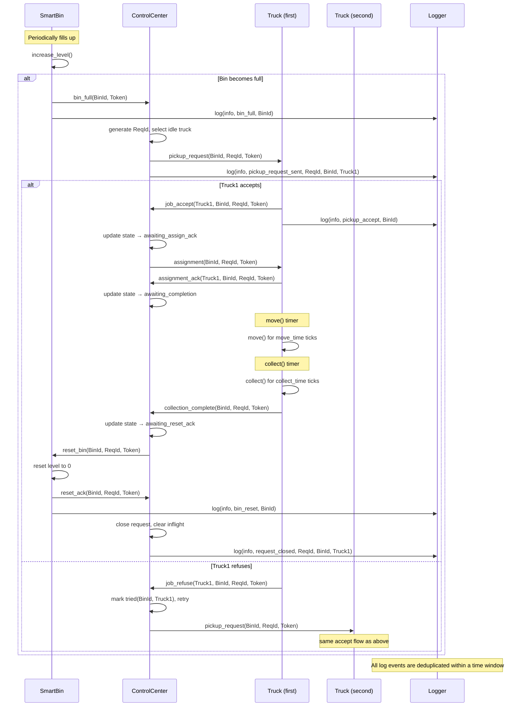

# SWMS — Smart Waste Management System

> A fully autonomous Multi-Agent System for urban waste collection, built on the **DALI** logic agent platform (SICStus Prolog).

---

# Overview

The Smart Waste Management System (SWMS) is a Multi-Agent System (MAS) built on the DALI agent platform. Its objective is to automate the urban waste collection process through the coordinated cooperation of autonomous agents.
When a smart bin reaches maximum capacity, the system automatically:

1. Detects the fill event and opens a tracked collection request
2. Selects the best available truck through a fault-tolerant dispatch protocol
3. Supervises the truck's movement and collection phases using TTL-based timeout monitoring
4. Resets the bin to operational state once collection is confirmed

The entire workflow executes autonomously without human intervention and is resilient to:

- Truck refusals
- Delayed acknowledgements
- Lost messages
- Assignment timeouts
- Collection failures

These fault-tolerance behaviours are implemented directly inside the DALI agent logic through retries, escalation rules, and supervision cycles.

---

## System Objective


The **Smart Waste Management System (SWMS)** is a Multi-Agent System built on the DALI agent platform.

Its objective is to automate urban waste collection through coordinated cooperation among autonomous intelligent agents capable of:

- Monitoring waste levels
- Dispatching collection resources
- Handling communication failures
- Supervising collection completion
- Maintaining structured event logging

---
## 1.1 Agents Roles

| Role | Description |
|---|---|
| **SmartBin** | A smart waste container that monitors its fill level. When full, it requests emptying. It can be reset to empty. |
| **Truck** | A vehicle that can accept a pickup job, travel to the bin, collect the waste, and report completion. It may refuse jobs when busy. |
| **ControlCenter** | The central coordinator that receives bin-full notifications, assigns a suitable truck, tracks the request through its lifecycle (reply, assignment, completion, reset), and handles timeouts and retries. |
| **Logger** | A passive observer that records significant events (with deduplication) for audit and debugging. |


# 1.2 Virtual Organization Overview

- `Name:`Smart Waste Management System — SWMS
- `Goal` The system monitors the fill level of distributed smart bins across a city. When a bin reaches maximum capacity, the system automatically orchestrates the dispatch of a collection truck, supervises the pickup lifecycle, and resets the bin to an operational state — without human intervention.
- `Agents` SmartBin, controlcentre, garbagetruck, logger


The SWMS architecture is organized into three functional layers.

# Architecture

```text
┌─────────────────────────────────────────────────────┐
│                 MANAGEMENT LAYER                    │
│     ControlCenter (Coordinator / Supervisor)        │
└────────────────────┬────────────────────────────────┘
                     │
                     │ Task Delegation
                     ▼
        ┌───────────────────────────────┐
        │                               │
        ▼                               ▼
┌──────────────────┐      ┌────────────────────────┐
│   FIELD LAYER    │      │    SENSING LAYER       │
│   Truck ×3       │      │    SmartBin ×3         │
└──────────────────┘      └────────────────────────┘
        │                               │
        └──────────────┬────────────────┘
                       ▼
             ┌────────────────────┐
             │   SUPPORT LAYER    │
             │     Logger ×1      │
             └────────────────────┘
```

---

## Agent Definitions

| Agent | Instances | Role |
|---|---|---|
| `control_center` | 1 | Coordinator and supervisor |
| `truck1`, `truck2`, `truck3` | 3 | Waste collection executors |
| `smart_bin1`, `smart_bin2`, `smart_bin3` | 3 | Smart sensing bins |
| `logger` | 1 | Centralized event logger |

---

## Communication Protocol

All inter-agent communication includes a shared authentication token:

```text
city_token_2026
```

The coordination protocol follows a structured FIPA-inspired request-response lifecycle tracked through four states:

```text
awaiting_reply
→ awaiting_assign_ack
→ awaiting_completion
→ awaiting_reset_ack
```

## 1.3 Interaction model (protocols)

| Initiator | Responder | Protocol | Purpose |
|----|----|----|----|
|SmartBin |ControlCenter| `NotifyFull`| SamrtBin signals it is full|
|ControlCenter | Truck | `PickupRequest` |Ask a Truck to empty a Smartbin|
|Truck | ControlCenter | `JobAccept` | Trucks Accept the job|
|Truck | ControlCenter | `JobRefuse` | Truck Refuses |
|ControlCenter | Truck | `Assignment` | Assign the job (After Accept).|
|Truck| ControlCenter | `AssignmentAck`| Acknowledge aasignment.|
|Truck | ControlCenter | `CollectionComplete`| Waste collected |
|ControlCenter | Smartbin| `Reset` | Command Smartbin to empty itself|
|SMartbin | ControlCenter | `ResetAck`| SmartBin confirms Reset|
|Any Agent| Logger | `log`| Record an Event|

## 1.4 Agent Event table.
## 1.4.1 ControlCenter — Event Table
| Event | Source | Trigger | Description |
|---|---|---|---|
| `bin_full(Bin, Token)` | SmartBin | Fill level = 100% | Bin requests collection; opens new request or resends assignment |
| `job_accept(Truck, Bin, ReqId, Token)` | Truck | Truck accepts pickup | Triggers `assignment` dispatch; truck marked busy |
| `job_refuse(Truck, Bin, ReqId, Token)` | Truck | Truck refuses pickup | Marks truck as tried; retries with next available truck |
| `assignment_ack(Truck, Bin, ReqId, Token)` | Truck | Truck confirms assignment | Advances inflight stage to `awaiting_completion` |
| `collection_complete(Bin, ReqId, Token)` | Truck | Truck finishes collection | Closes inflight record; sends `reset_bin` to SmartBin |
| `reset_ack(Bin, ReqId, Token)` | SmartBin | Bin confirms reset | Fully closes the request lifecycle 

**Core Lifecycle Events** *(internal protocol transitions)*

| Event | Source | Trigger | Description |
|---|---|---|---|
| `handle_bin_full_new(Bin)` | Internal | No open request for Bin | Opens a new collection request; generates `ReqId` |
| `handle_bin_full_retry(Bin, ReqId, T)` | Internal | Request already open | Resends `assignment` to the currently assigned truck |
| `dispatch_bin_full(Bin, ReqId, T)` | Internal | After truck selected | Opens inflight record; sends `pickup_request` to truck |
| `do_accept(Truck, Bin, ReqId)` | Internal | After `job_accept` | Sets truck busy; sends `assignment` |
| `do_refuse(Truck, Bin, ReqId)` | Internal | After `job_refuse` | Records tried truck; selects next idle truck |
| `do_ack(Truck, Bin, ReqId, R)` | Internal | After `assignment_ack` | Advances inflight stage |
| `do_collect_complete(Bin, ReqId, Truck)` | Internal | After `collection_complete` | Sends `reset_bin`; marks request complete |
| `do_reset_ack(Bin, ReqId, Truck)` | Internal | After `reset_ack` | Removes inflight record; request fully closed |

# 3. Collection Workflow



## Key Features

- **Fully autonomous operation** — no polling or human triggers required once started
- **Fault-tolerant dispatch** — truck refusals and timeouts cause automatic retry with backoff
- **Idempotent message handling** — duplicate messages are safely ignored at every agent
- **TTL-based supervision** — four independently tunable timeout windows per request
- **Structured logging** — all lifecycle events emitted to a central logger with deduplication
- **Real-time dashboard** — WebSocket-based web UI streams live agent state and event log
- **Token authentication** — all messages validated against a shared secret before processing


## Technology Stack
=======
# 4. Technology Stack
>>>>>>> 348004b (readme update)

| Component | Technology |
|---|---|
| Agent platform | DALI — Dynamic Agent Logic and Interaction |
| Prolog runtime | SICStus Prolog 4.6 |
| Agent coordination | Linda tuple-space |
| Session management | tmux |
| Dashboard backend | Python 3 + FastAPI + WebSocket |
| Dashboard frontend | HTML5 + CSS + JavaScript |

---

# 5. Repository Layout

```text
SWMS_MAS_System/
├── src/                   # DALI platform source files
├── mas/
│   ├── types/             # Agent type definitions
│   │   ├── control_center.txt
│   │   ├── truck.txt
│   │   ├── smart_bin.txt
│   │   └── logger.txt
│   │
│   └── instances/         # Agent instance declarations
│
├── conf/                  # Communication configuration
├── build/                 # Compiled agent artifacts
├── tmp/                   # Runtime working files
├── log/                   # Agent log output
│
├── dashboard/
│   ├── bridge.py          # FastAPI WebSocket bridge
│   ├── start.sh
│   └── static/index.html  # Dashboard UI
│
├── startmas.sh            # MAS launcher
└── GAIA_Design_Documentation.md
```

---

# 6. Getting Started

## Prerequisites

Install the following dependencies before running the system:

- SICStus Prolog 4.6.x
- tmux
- Python 3.9+
- pip

Expected SICStus installation path:

```bash
/usr/local/sicstus4.6.0
```

---

## Launch the Multi-Agent System

```bash
# Start all agents
./startmas.sh
```

Enable dashboard mode:

```bash
DASHBOARD=1 ./startmas.sh
```

---

## Startup Process

The launcher script automatically:

1. Terminates existing DALI/SICStus processes
2. Starts the Linda tuple-space coordination server
3. Launches each agent in a dedicated tmux pane
4. Applies staggered startup timing
5. Performs automatic health checks

---

# 7. Dashboard

Start the dashboard server:

```bash
cd dashboard

pip install -r requirements.txt

./start.sh
```

Open the dashboard in a browser:

```text
http://localhost:8000
```

---

# 8. Configuration Parameters

Timing parameters can be modified in:

```text
mas/types/*.txt
```

| Parameter | Agent | Default | Description |
|---|---|---|---|
| `cycle_interval_ms` | ControlCenter | 1000 ms | Supervision cycle interval |
| `reply_ttl` | ControlCenter | 6 cycles | Wait time for truck response |
| `assign_ack_ttl` | ControlCenter | 6 cycles | Wait time for assignment acknowledgment |
| `completion_ttl` | ControlCenter | 10 cycles | Wait time for collection completion |
| `reset_ack_ttl` | ControlCenter | 3 cycles | Wait time for bin reset acknowledgment |
| `deltaT` | SmartBin | 2 s | Fill simulation interval |
| `fill_step` | SmartBin | 20% | Fill increment per cycle |
| `move_time` | Truck | 2 ticks | Simulated travel duration |
| `collect_time` | Truck | 1 tick | Simulated collection duration |

---

# 9. Fault Tolerance Features

The SWMS includes several resilience mechanisms:

- Automatic truck reassignment
- Request retry escalation
- Timeout supervision
- Message acknowledgment tracking
- Duplicate log suppression
- Stateful request monitoring
- Distributed autonomous recovery

These mechanisms ensure reliable operation even under partial communication failures.

---

# 10. Design Documentation

<<<<<<< HEAD


This project is developed for academic research purposes. See [`LICENSE`](LICENSE) for details.


=======
Complete GAIA-based agent design documentation is available in:

```text
GAIA_Design_Documentation.md
```

The documentation includes:

- Roles model
- Interaction model
- Agent responsibilities
- Organizational rules
- Event tables
- Action tables
- Protocol specifications

---

# 11. License

This project is developed for academic and research purposes.

See:

```text
LICENSE
```

for licensing details.
>>>>>>> 348004b (readme update)
