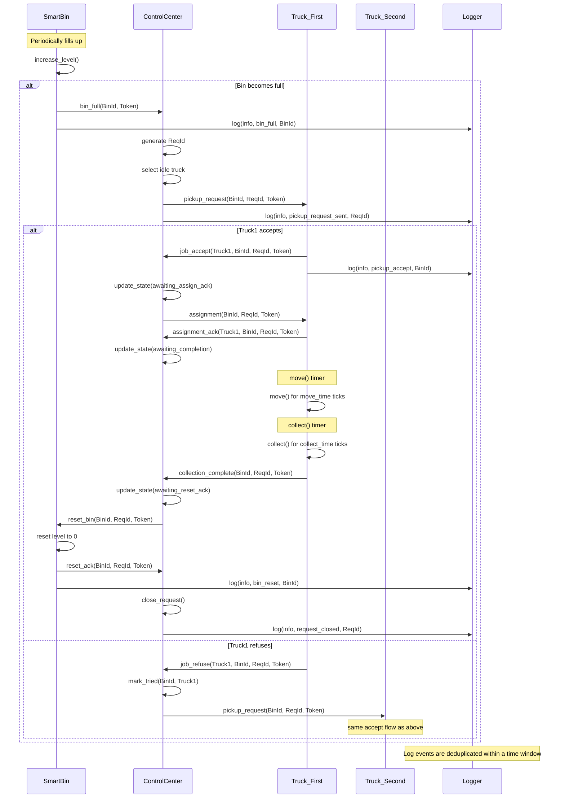

# SWMS — Smart Waste Management System

> A fully autonomous Multi-Agent System for urban waste collection, built on the **DALI** logic agent platform (SICStus Prolog).

---

## Overview

When a smart bin reaches maximum capacity, the system automatically:

1. Detects the fill event and opens a tracked collection request
2. Selects the best available truck through a fault-tolerant dispatch protocol
3. Supervises the truck's movement and collection phases via TTL-based timeout monitoring
4. Resets the bin to operational state once collection is confirmed

The entire workflow runs without human intervention and is resilient to truck refusals, delayed acknowledgements, lost messages, and collection timeouts — all handled directly inside the DALI agent logic.

---

## Architecture

```text
┌─────────────────────────────────────────────────────┐
│                 MANAGEMENT LAYER                    │
│     ControlCenter (Coordinator / Supervisor)        │
└────────────────────┬────────────────────────────────┘
                     │  task delegation
          ┌──────────┴──────────┐
          ▼                     ▼
┌──────────────────┐   ┌────────────────────────┐
│   FIELD LAYER    │   │    SENSING LAYER        │
│   Truck ×3       │   │    SmartBin ×3          │
└──────────────────┘   └────────────────────────┘
          │                     │
          └──────────┬──────────┘
                     ▼
           ┌────────────────────┐
           │   SUPPORT LAYER    │
           │     Logger ×1      │
           └────────────────────┘
```

---

## Agents

| Agent | Instances | Role |
|---|---|---|
| `control_center` | 1 | Coordinator and request lifecycle supervisor |
| `truck1`, `truck2`, `truck3` | 3 | Waste collection executors |
| `smart_bin1`, `smart_bin2`, `smart_bin3` | 3 | Sensing bins — fill, alert, and reset |
| `logger` | 1 | Centralized event logger with deduplication |

---

## Collection Workflow


---

## Technology Stack

| Component | Technology |
|---|---|
| Agent platform | DALI — Dynamic Agent Logic and Interaction |
| Prolog runtime | SICStus Prolog 4.6 |
| Agent coordination | Linda tuple-space |
| Session management | tmux |
| Dashboard backend | Python 3 + FastAPI + WebSocket |
| Dashboard frontend | HTML5 + CSS + JavaScript |

---

## Repository Layout

```text
SWMS_MAS_System/
├── src/                   # DALI platform source files
├── mas/
│   ├── types/             # Agent type definitions (.txt)
│   └── instances/         # Agent instance declarations
├── conf/                  # Communication configuration
├── build/                 # Compiled agent artifacts
├── tmp/                   # Runtime working files
├── log/                   # Agent log output
├── dashboard/
│   ├── bridge.py          # FastAPI WebSocket bridge
│   ├── start.sh
│   └── static/index.html  # Dashboard UI
├── startmas.sh            # MAS launcher
└── GAIA_Design_Documentation.md
```

---

## Getting Started

### Prerequisites

- SICStus Prolog 4.6.x (expected at `/usr/local/sicstus4.6.0`)
- tmux
- Python 3.9+

### Launch the MAS

```bash
./startmas.sh
```

With dashboard:

```bash
DASHBOARD=1 ./startmas.sh
```

### Launch the Dashboard

```bash
cd dashboard
pip install -r requirements.txt
./start.sh
```

Open `http://localhost:8000` in a browser.

---

## Configuration

Timing parameters are set in `mas/types/*.txt`:

| Parameter | Agent | Default | Description |
|---|---|---|---|
| `cycle_interval_ms` | ControlCenter | 1000 ms | Supervision cycle interval |
| `reply_ttl` | ControlCenter | 6 cycles | Timeout waiting for truck response |
| `assign_ack_ttl` | ControlCenter | 6 cycles | Timeout waiting for assignment ack |
| `completion_ttl` | ControlCenter | 10 cycles | Timeout waiting for collection |
| `reset_ack_ttl` | ControlCenter | 3 cycles | Timeout waiting for bin reset ack |
| `deltaT` | SmartBin | 2 s | Fill simulation interval |
| `fill_step` | SmartBin | 20% | Fill increment per cycle |
| `move_time` | Truck | 2 ticks | Simulated travel duration |
| `collect_time` | Truck | 1 tick | Simulated collection duration |

---

## Design Documentation

Full GAIA-based agent design — roles, interaction model, event tables, action tables, and protocol specifications — is in:

[GAIA_Design_Documentation.md](GAIA_Design_Documentation.md)

---

## License

Developed for academic and research purposes.
