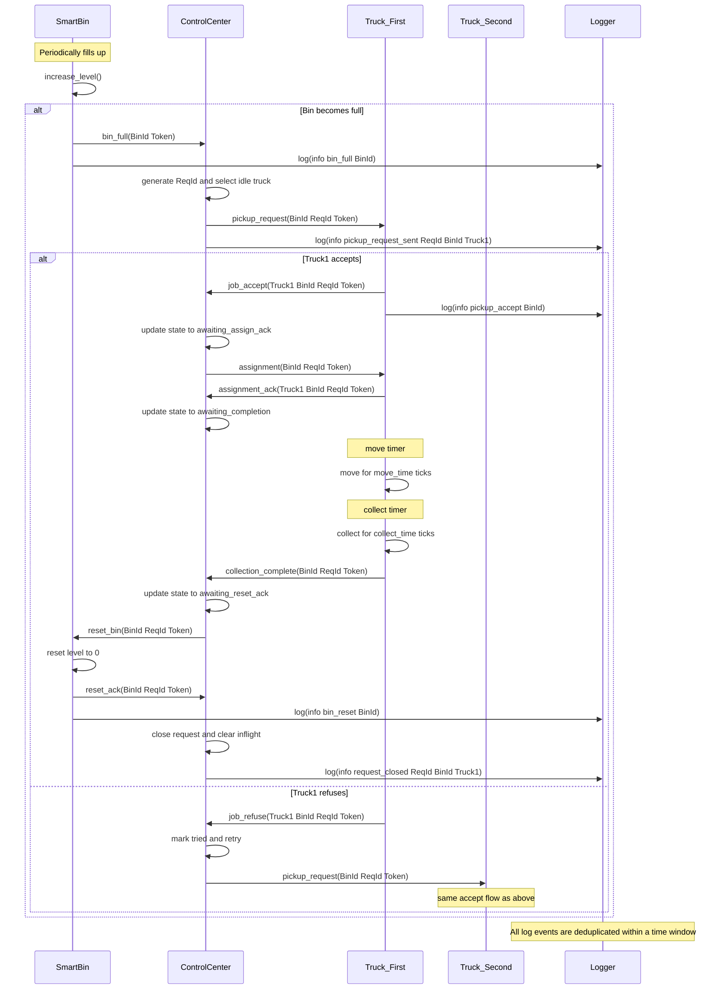

# SWMS — Smart Waste Management System

> A fully autonomous Multi-Agent System for urban waste collection, built on the **DALI** logic agent platform (SICStus Prolog).

---

## Overview

**SWMS** is a research-grade Multi-Agent System (MAS) that simulates and automates the complete lifecycle of urban waste collection. The system is composed of eight cooperative autonomous agents — smart bins, collection trucks, a central coordinator, and a logger — each running as an independent DALI agent with its own reactive/proactive logic.

When a smart bin reaches maximum capacity, the system automatically:

1. Detects the fill event and opens a tracked collection request
2. Selects the best available truck through a fault-tolerant dispatch protocol
3. Supervises the truck's movement and collection phases via TTL-based timeout monitoring
4. Resets the bin to operational state once collection is confirmed

The entire pipeline runs without human intervention and is resilient to truck refusals, delayed acknowledgements, and message loss — all handled through automatic retry and escalation logic built directly into the agent behaviours.

---

## 1. System Objective

The **Smart Waste Management System (SWMS)** is a Multi-Agent System (MAS) built on the DALI agent platform. Its objective is to automate the urban waste collection process through the coordinated cooperation of autonomous agents.

## 2. Agent Roles and Virtual Organization

### 2.1 Virtual Organization Overview

The SWMS defines a hierarchical virtual organization with three functional layers:
## Architecture

```
┌─────────────────────────────────────────────────────┐
│              MANAGEMENT LAYER                       │
│   ControlCenter  (coordinator + supervisor)         │
└────────────────────┬────────────────────────────────┘
                     │  task delegation
        ┌────────────┴────────────┐
        ▼                         ▼
┌───────────────┐       ┌───────────────────┐
│ FIELD LAYER   │       │  SENSING LAYER    │
│ Truck ×3      │       │  SmartBin ×3      │
└───────────────┘       └───────────────────┘
        │                         │
        └──────────┬──────────────┘
                   ▼
          ┌─────────────────┐
          │  SUPPORT LAYER  │
          │  Logger ×1      │
          └─────────────────┘
```

| Agent | Instances | Role |
|---|---|---|
| `control_center` | 1 | Coordinator / Supervisor |
| `truck1`, `truck2`, `truck3` | 3 | Field executors |
| `smart_bin1`, `smart_bin2`, `smart_bin3` | 3 | Sensors / Actuators |
| `logger` | 1 | Centralised structured logging |

All inter-agent messages carry a shared authentication token (`city_token_2026`) and follow a strict FIPA-inspired request-response protocol tracked through four named stages:

```
awaiting_reply → awaiting_assign_ack → awaiting_completion → awaiting_reset_ack
```


## Collection Protocol



If a truck is busy, the control center automatically retries with the next available truck. Each protocol stage is independently guarded by a configurable TTL counter so no request can stall indefinitely.


## Key Features

- **Fully autonomous operation** — no polling or human triggers required once started
- **Fault-tolerant dispatch** — truck refusals and timeouts cause automatic retry with backoff
- **Idempotent message handling** — duplicate messages are safely ignored at every agent
- **TTL-based supervision** — four independently tunable timeout windows per request
- **Structured logging** — all lifecycle events emitted to a central logger with deduplication
- **Real-time dashboard** — WebSocket-based web UI streams live agent state and event log
- **Token authentication** — all messages validated against a shared secret before processing


## Technology Stack

| Component | Technology |
|---|---|
| Agent platform | [DALI](https://github.com/AAAI-DISIM-UnivAQ/DALI) — Dynamic Agent Logic and Interaction |
| Prolog runtime | SICStus Prolog 4.6 |
| Agent coordination | Linda tuple-space (port 3010) |
| Session manager | `tmux` (one pane per agent) |
| Dashboard backend | Python 3 · FastAPI · WebSocket |
| Dashboard frontend | Vanilla HTML5 / CSS / JavaScript |

---

## Repository Layout

```
SWMS_MAS_System/
├── src/                   # DALI platform source files
├── mas/
│   ├── types/             # Agent type definitions (Prolog)
│   │   ├── control_center.txt
│   │   ├── truck.txt
│   │   ├── smart_bin.txt
│   │   └── logger.txt
│   └── instances/         # Agent instance declarations
├── conf/                  # Communication configuration
├── build/                 # Compiled agent artefacts
├── tmp/                   # Runtime working files
├── log/                   # Log output per agent
├── dashboard/
│   ├── bridge.py          # FastAPI WebSocket log bridge
│   ├── start.sh
│   └── static/index.html  # Live dashboard UI
├── startmas.sh            # One-shot launcher script
└── GAIA_Design_Documentation.md
```

---

## Getting Started

### Prerequisites

- SICStus Prolog 4.6.x installed at `/usr/local/sicstus4.6.0`
- `tmux` available in `PATH`
- Python 3.9+ with `pip` (for the dashboard)

### Launch the MAS

```bash
# Start all 8 agents in a tmux session
./startmas.sh

# Optionally enable the web dashboard
DASHBOARD=1 ./startmas.sh
```

The script will:
1. Kill any existing SICStus/DALI processes
2. Start the Linda coordination server
3. Launch each agent in its own `tmux` pane with a configurable stagger delay
4. Run an automatic health check after startup

### Dashboard

```bash
cd dashboard
pip install -r requirements.txt
./start.sh
# Open http://localhost:8000 in a browser
```

### Configuration

Key timing parameters (edit the relevant `mas/types/*.txt` file):

| Parameter | Agent | Default | Description |
|---|---|---|---|
| `cycle_interval_ms` | ControlCenter | 1000 ms | Main supervision cycle period |
| `reply_ttl` | ControlCenter | 6 cycles | Timeout waiting for truck reply |
| `assign_ack_ttl` | ControlCenter | 6 cycles | Timeout waiting for assignment ack |
| `completion_ttl` | ControlCenter | 10 cycles | Timeout waiting for collection complete |
| `reset_ack_ttl` | ControlCenter | 3 cycles | Timeout waiting for bin reset ack |
| `deltaT` | SmartBin | 2 s | Heartbeat period (fill cycle) |
| `fill_step` | SmartBin | 20% | Fill increment per tick |
| `move_time` | Truck | 2 ticks | Simulated travel time to bin |
| `collect_time` | Truck | 1 tick | Simulated waste collection time |

---

## Design Documentation

Full GAIA-BASE agent design (roles, virtual organization, interaction model, event tables, action tables) is available in [`GAIA_Design_Documentation.md`](GAIA_Design_Documentation.md).

---

## License


This project is developed for academic research purposes. See [`LICENSE`](LICENSE) for details.


